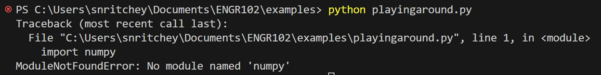
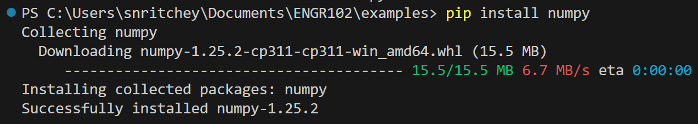
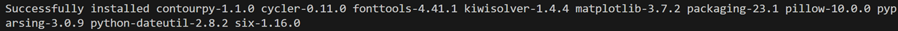
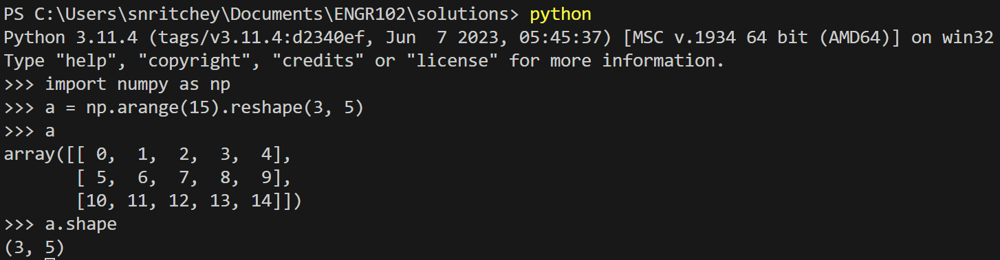

# ENGR 102 Lab Topic 12 (team)
There are two deliverables for this team assignment. Please submit the files below to **Canvas**. Please include the team header information at the top of each file with the names of all contributing team members. This is a team assignment, but **everyone** must submit the files for credit. You may discuss the problems with other teams, but your submitted work must be unique. Check out the [Frequently Asked Questions](#frequently-asked-questions) below.

This week's team and individual assignments are meant to familiarize you with two of the most commonly used engineering packages in Python: `numpy` and `matplotlib`. It will also begin to give you more experience in using modules. To do this, **as a team** you will work some of the basic tutorial/intro material for each one, **and ensure that each member of the team knows how it works**.

`numpy` is a package for performing scientific computing. In particular, it offers functions and types that will allow you to create vectors and matrices, and perform linear algebra operations more easily. [The website for `numpy` is found here.](http://www.numpy.org/)

`matplotlib` is a library for creating plots, graphs, and charts. It supports a wide range of plots and graphs, and is often used for visualizing data. [The website for `matplotlib` is found here.](https://matplotlib.org/)

## Activities

0. [Check for package installation](#check-for-package-installation)
1. [numpy](#numpy)
2. [matplotlib](#matplotlib)

## Check for package installation
Both of these may already be installed on your system depending on what distribution of Python you downloaded. If you do not have `numpy` or `matplotlib`, follow the instructions below. You should first check to ensure they are installed on your system.

Create a program with two lines of code:
```python
import numpy
import matplotlib
```

and try to run this program. If the program runs without an issue (no errors), then you have both packages installed. If you get an error, then at least one is not installed. You may need to ask for help in getting this to run.

### How to install `numpy` and `matplotlib` with VS Code
<ol>
<li>Open VS Code</li>
<li>Verify you don’t have NumPy or Matplotlib installed</li>
  <ul>
  <li>Run the single line of code <code>import numpy</code> or <code>import matplotlib</code></li>
  <li>If the code runs without an error, the packages are already installed and you don’t need to do anything!</li>
  <li>You will get an error message if you don’t have them installed:</li>
  <li></li></ul>
<li>In the terminal run the command <code>pip install numpy</code></li>
  <ul>
  <li></li>
  <li>Wait for it to finish, it should end with <code>Successfully installed...</code></li>
  <li></li></ul>
<li>In the terminal run the command <code>pip install matplotlib</code></li>
  <ul>
  <li></li>
  <li>Wait for it to finish</li>
  <li>There may be a lot of output on this one, but it should end with <code>Successfully installed...</code></li>
  <li></li></ul>
<li>Verify it worked by rerunning the code from step 2</li>
<li>Celebrate by plotting stuff!</li>
</ol>

```python
import numpy as np
import matplotlib.pyplot as plt
from random import randint
for i in range(229):
    plt.plot(randint(1,100), randint(1,100), marker=(5,1,randint(0,360)), color='w', markeredgecolor='maroon')
plt.axis('off')
plt.show()
```

## numpy
The point of this activity is to familiarize your team with the basic matrix and vector structures and operations in `numpy`. It will also begin to give you more experience in making function calls and using a module. You will do this by going through the `numpy` tutorial as a team, and making some small modifications along the way.

1. First go to the [`numpy` home page](http://www.numpy.org/), then click on "Learn" (at the top). The "NumPy Quickstart Tutorial" shows several commands in the context of an interactive python interpreter. Your team should have one team member share their screen and try entering and modifying the code described below for everyone to see. Each team member may want to read the documentation as you work through the examples together.
2. As a team, work through parts of the tutorial (listed in 3. below). For each part, your team should do the following:
   1. If there is text, read it, and check to make sure that everyone understands it. For any code in a section, do parts ii-v below.
   2. Write the code in your own IDE and execute it. You will probably need to add in print statements to print out values of variables that are shown automatically in the interactive view.
   3. Verify that the output is what you expect – that the arrays are created correctly and the values are computed.
   4. Make some modification to the code (e.g. to the entries of a matrix) and rerun to make sure you see how the various functions behave.
   5. Ask everyone in the group if they follow what has happened in that section. Do not go on until each person states that they understand.
      - If some team members do not understand, others should help explain the topics.
      - If all of you are stuck, or need help, ask a member of the teaching team.
   6. Then, go on to the next section.
3. The parts of the tutorial to work through (there is a "Table of Contents" on the right side of the page) are:
   - The Basics – An example
   - The Basics – Array Creation
   - The Basics – Printing Arrays
   - The Basics – Basic Operations
   - The Basics – Universal Functions
   - Shape Manipulation – Changing the shape of an array
   - (Optional) Check out NumPy: the absolute basics for beginners (in the left menu) for a more detailed explanation of concepts
4. At the end, each person on the team should understand how to create arrays of various sizes, how to perform basic linear algebra operations (calculate dot product or do matrix multiplication), and how to use mathematical functions on an array.
5. Finally, to demonstrate that your team understands how this process works, create a program named `numpy_example.py` that does the following:
   1. Start your program with the following statement in comments after the header:
   ```
   # As a team, we have gone through all required sections of the 
   # tutorial, and each team member understands the material
   ```
	 2. Create 3 matrices, $$A$$, $$B$$, and $$C$$, of size 3x4, 4x2, and 2x3, respectively. For each matrix, have the first element be zero (0), and increase each subsequent element by one (1). Print each of these matrices with a single blank line in between.
	 3. Compute the product $$D=ABC$$ and print the resulting matrix and a blank line. (Note: this is **matrix multiplication** not simple elementwise multiplication.)
	 4. Print the transpose of $$D$$ and a blank line.
   5. Calculate and print $$E=\sqrt{D}/2$$.

Example output:
```
A = [[ 0  1  2  3]
 [ 4  5  6  7]
 [ 8  9 10 11]]

B = [[0 1]
 [2 3]
 [4 5]
 [6 7]]

C = [[0 1 2]
 [3 4 5]]

D = [[ 102  164  226]
 [ 294  468  642]
 [ 486  772 1058]]

D^T = [[ 102  294  486]
 [ 164  468  772]
 [ 226  642 1058]]

E =  [[ 5.04975247  6.40312424  7.51664819]
 [ 8.5732141  10.81665383 12.66885946]
 [11.02270384 13.89244399 16.26345597]]
```

## matplotlib
The purpose of this activity is for your team to review some of the capabilities of `matplotlib`, get practice learning how to find the parameter settings for various graphs, and make a few plots. **As a team**, create three (3) different plots described below. The expectation is that you will all work together to ensure everyone knows how to handle different aspects of the process.

1. First go to the [`matplotlib` website](https://matplotlib.org/). Similar to what was done with Activity #1, you should work through the code provided on this page for training.
   1. Click on "Tutorials" (at the top) and then select "Pyplot tutorial". Your team should go through the tutorial, as was done for `numpy` in Activity #1.
   2. You can also check out the "Examples" page to see a range of examples of plots that can be produced.
   3. Do not do more until everyone has followed the tutorial, and agreed that they understand it, and that the group has briefly looked at several examples.
2. There are several sections that are a bit beyond what we need to learn. For this week, you should learn how to accomplish the following tasks:
   1. Create a figure.
   2. Plot numerical data (this includes plotting multiple sets of data on the same figure).
   3. At a minimum, label the figure with a title, x-axis label, and y-axis label.
   4. Control the x- and y-axis scale values.
   5. Create a legend.
   6. Control the width, color, and style of a plotted line.
   7. Control the width, color, and shape of plotted points.
   8. Create subplots within a single figure.
3. **As a team**, create a program named `matplotlib_example.py` that produces the three (3) plots described below (on separate plots). **Include the same statement in comments as you did in Activity #1.** Each plot should include the plotted data, a meaningful title to describe the data, labels for the x- and y- axes, and a legend when plotting two (2) or more things. Feel free to change the colors, markers, and line styles, unless otherwise noted. *This activity will be manually graded.*

**Useful hint:** to establish an array of x-values, check out `numpy.linspace()`.

Create the following plots:
<ol>
 <li>One equation for a parabola is given below in terms of its focal length ($$f$$):
	 
$$y=\frac{1}{4f}x^2$$

Write the Python code to plot two parabolas as lines on the same plot for the domain $$-2≤x≤2$$ for $$f=2$$ and $$f=6$$. Choose different colors for each line. Make the line for $$f=6$$ width of 6 and the line for $$f=2$$ width of 2.</li>
 <li>Write the Python code to plot ($$x,y$$) points for the cubic polynomial

$$y=2x^3+3x^2-11x-6$$

for the domain $$-4≤x≤4$$. Twenty-five (25) data points were used for the plot below.</li>
 <li>Write the Python code to plot $$\sin⁡(x)$$ and $$\cos⁡(x)$$ using two subplots with different color lines for the domain $$-2π≤x≤2π$$. Display a grid on both plots.</li>
</ol>

## Frequently Asked Questions
1. **What's the difference between elementwise product and matrix product?** Elementwise product is the math you're used to: multiply the values in one matrix by the values in the same index location in another matrix. Matrix product (or [matrix multiplication](https://en.wikipedia.org/wiki/Matrix_multiplication)) is fancy matrix math that you will learn in a linear algebra class. You don't have to understand it right now, just know that you need to use the `@` symbol to get NumPy to do it.

2. **Activity 1 I copy/pasted the example code from NumPy's website and I get syntax errors. What gives?** Wait... you COPIED CODE? FROM THE INTERNET? Don't do that! You'll remember it better if you type it yourself! Also, the code shown on their website is written like what you would see in Jupyter notebooks or using the command line instead of a script (file). The lines that begin with `>>>` are what you execute, the lines below are the output. In your terminal, type `python` and press enter. Then try typing the lines that start with `>>>` in your console window like this:

Type `quit()` to return to normal.

3. **Activity 1 when I type `a.dtype.name` it outputs `int32` instead of `int64`. What's going on?** `int32` means it's an integer stored using 32 bits. `int64` uses 64 bits. You can store a much larger number with 64 bits compared to 32 bits. The output is based on the software on your machine and how much memory it's using to store the data. This stuff is beyond ENGR 102 so you don't need to understand it. Also, `itemsize` is a conversion between bits and bytes, so when you type `a.itemsize`, it's going to return whatever number you got for `dtype` divided by 8 (32 bits is 4 bytes).

4. **Matplotlib has a lot of stuff. How much do I have to memorize?** Very little! My personal philosophy is that when you eventually need to make nice plots of data, you will have access to Matplotlib's website to look up everything you need. In grad school and my previous job, I used to spend time coding up a nice plot, then save the code to reuse with future data. Code once and reuse over and over again. I expect you to be able to read code that uses the basics of Matplotlib (like the stuff in the tutorial), but nothing fancy.

5. **How do I do XXX in Matplotlib?** My advice: look at the examples on Matplotlib's website, find one that does what you want to do, click on it and look at the code. Try clicking on some of the lines of code for more information on what it does. Also check out [Matplotlib's handouts](https://matplotlib.org/cheatsheets/) and [an example video](https://tamu.video.yuja.com/V/Video?v=16309822&node=69581067&a=62181216).

Have a question you don't see here? Email your instructor!

Based upon Dr. Keyser’s Original<br/>
Revised Summer 2026 SNR
